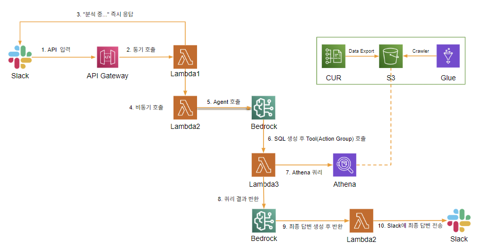
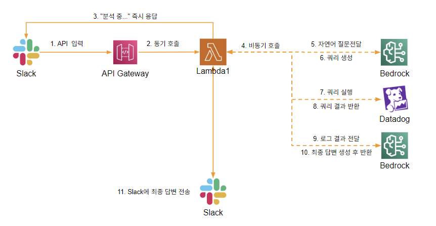
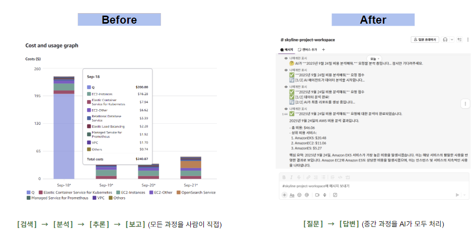

# 🤖 GenAI 기반 AIOps 운영 자동화 PoC

MSA 환경의 복잡한 로그 및 비용 데이터를 Slack에서 자연어로 분석하고 해결하는 지능형 운영 자동화 플랫폼 PoC 프로젝트입니다. (인턴십 기간 동안 진행한 프로젝트로, 현재 AWS 리소스는 삭제된 상태입니다.)

---

## 🎯 프로젝트 배경
클라우드 환경이 복잡해짐에 따라, 엔지니어들은 예측하기 어려운 비용을 분석하는 데 많은 시간을 소요하고 있습니다. 본 프로젝트는 이러한 반복적이고 소모적인 운영 업무를 GenAI를 통해 자동화하여, 엔지니어들이 더 높은 가치를 창출하는 업무에 집중할 수 있도록 돕기 위해 시작되었습니다.

---

## 🏗️ 솔루션 아키텍처
본 솔루션은 AWS의 서버리스 서비스와 Amazon Bedrock을 중심으로 구축되었으며, 모든 인프라는 Terraform을 통해 코드로 관리(IaC)됩니다. 사용자가 Slack에서 질문하면, API Gateway와 Lambda를 거쳐 Bedrock Agent가 질문의 의도를 파악하고 Athena DB를 조회하여 최종 분석 결과를 다시 Slack으로 전달하는 구조입니다.

---

## 솔루션 아키텍처2 (로그)

## ✨ 핵심 기능 및 데모

### 대화형 비용 분석 (Cost AIOps)
- **Before:** 전문가가 AWS Cost Explorer 보고서를 수동으로 분석하여 공유
- **After:** 재무/기획 담당자도 Slack에서 직접 비용 현황을 질문하고 실시간으로 확인

---

## 🛠️ 기술 스택
- **Cloud:** AWS (Lambda, API Gateway, S3, Athena, Glue, Secrets Manager)
- **GenAI:** Amazon Bedrock (Agent, Claude Haiku)
- **IaC:** Terraform
- **Language:** Python 3.13
- **CI/CD:** GitHub Actions
- **Collaboration:** Slack

---

## 💡 배운 점 및 회고
이번 프로젝트를 통해 단순히 기술을 구현하는 것을 넘어, 고객의 'Pain Point'를 해결하는 비즈니스 가치를 직접 설계하고 증명하는 값진 경험을 했습니다. 특히, Bedrock Agent와 같은 최신 기술을 활용하여 '어떻게 하면 더 스마트하게 문제를 해결할 수 있을까'를 깊이 고민하는 과정에서 엔지니어로서 크게 성장할 수 있었습니다.

**Next Step:** 현재는 인프라 비용 데이터에 집중했지만, 향후 APM을 연동하여 실제 비즈니스 트랜잭션 데이터(예: '항공권 예약 수', '결제 실패율')까지 함께 분석한다면, "가장 비용 효율적인 항공 노선은 어디인가?" 와 같은 비즈니스에 직접적인 가치를 주는 질문에도 답할 수 있을 것입니다.
